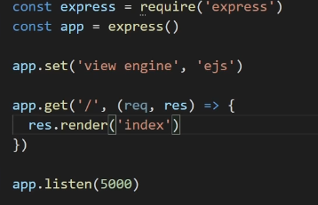

Kisa acilis ayarlari:
npm init -y = projenin icinde
npm i express mongoose ejs axios = yuklemek istedigimiz bilesenler

npm i --save-dev nodemon  = installing dev dependencies
nodemon icin package de script eklenir "watch": "nodemon server.js".
server.js create edilir,ve asagidaki yazilir

views folder olusturulup index.ejs eklenir

app.use(express.urlencoded({ extended: false})) server.js eklenir //req.body.text bilmemne diyerek dataya ulasmamizi 
sagliyor

1-console: npm init -y = proje folderinda node init edilir
2-console: npm install express = proje folderinda express installanir
3- console : npm instal ejs = ejs(view engine) paket yuklenir
4- console : npm install nodemon = refresh yaparak codedaki yeni ayarlari gormemizi saglar
5- package.json da "watch": "nodemon app" scriptlere eklenir, npm run watch dedigimizde site calisir

sudo npm install validator == email login password falan hazir metodlari var duzgun girilip girilmedigini test etmek icin

** npm install @types/node; komutu intellisense bozuklugunda belki ise yarar, node yerine express, validator falan yazilir

npm install mongodb -- npm install mongodb@versiyon numarasi seklinde(package.json) de yazilir. 2.incisi tutorialdan gidiyorsak daha iyi

npm install dotenv == root folder .env olusturup burada CONNECTIONSTRING gibi istedigimiz seyleri atayip kullanabiliyoruz